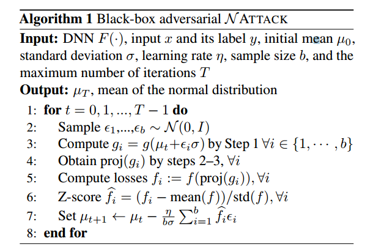

# 第一遍
## 标题
 $\mathcal{N}ATTACK$对深度神经网络的黑盒攻击的对抗样本的分布
## Abstract 
提出攻击神经网络，特点是不直接输出攻击对象而是在输入的中心找到一个概率密度分布，可以攻击不同的网络。同时证明了最好的防御网络还是通过对抗训练训练出的神经网络
## 图表
### table1
对十三个网络的攻击结果，在CIFAR10和ImageNet上的结果。
### Figure1
列出13种网络的防御等级评估
### Figure 2
BPDA和$\mathcal{N}attck$的可迁移性
## Conclusion and Future Work
提出了一种黑盒攻击方法，在输入的$l_p-ball$上学习分布概率。好处是可以将$g(\cdot)$任意变化，有助于降维。同时，对抗性训练的防御网络很难迁移。
本文不是从超几何维度看待攻击样本，而是从概率密度的角度来看待的。
# 第二遍看
## Introduction
### 背景
攻击神经网络，发现存在攻击样本，攻击样本是普遍存在的，同时存在相同的攻击样本。
攻击样本存在的原因有许多观点
- dnn在高维输入空间为线性，会导致微小扰动在高维空间变大
- 许多人在研究输入空间的几何和拓扑。
- 还存在许多未知的因素
### 方法介绍
- 黑盒攻击
- GitHub地址https://github.com/Cold-Winter/Nattack
- 采用了自然进化策略。
    用约束的NES公式来作为目标函数，而不是估计梯度。
- 对抗样本的概率密度分布是一个参数分布，为了获取较好的初始值，先用一个回归函数神经网络获取了较好的初始值。
- 优点：在低维空间指定分布，可以通过分布获取无限多的样本，比基于梯度优化更有效
## Approach
前提：
- $x\in [0,1]^{dim(x)},C(x)=\argmax f(x)_i=y$寻找一个对抗样本$x_{adv}$,使得$C(x_{adv})\neq y$
- 同时不使用DNN分类错误的样本
- $x_{adv}$在$l_p-ball$内，即
$$
    x_{adv}\in S_p(x):=\{x^{'}:\Vert x-x^{'}\Vert_p\leq \tau_p\},p=2 or \infty
$$
$proj_S(x^{'})$表示在$S$上的投影

- 该实验不依赖dnn的梯度
### 2.1 A Black-box Adcersarial Attack by NES
NES认为寻找对抗样本为如下最优化公式：
$$
\begin{align}
    x_{adv}\leftarrow\argmin_{x^{'}\in S}f(x^{'})
\end{align}
$$
通过投影梯度最小化求解
$$
\begin{align}
    x_{t+1}\leftarrow proj_S(x_t-\eta sign(\nabla f(x_t)))
\end{align}
$$
通过NES来估计$\nabla f(x_t)$
$$
\begin{align}
    \nabla f(x_t)&\approx \nabla_{x_t}\mathbb{E}_{\mathcal{N}(z|x_t,\sigma^2)}f(z)\\
    &=\mathbb{E}_{\mathcal{N}(z|x_t,\sigma^2)}f(z)\nabla_{x_t}\log \mathcal{N}(z|x_T,\sigma^2)
\end{align}
$$
$\mathcal{N}(z|x_t,\sigma^2)$的正太分布
则SGD为
$$
    x_{t+1}\leftarrow proj_s(x_t-\eta sign(\frac{1}{b}\sum^b_{i=1}f(z_i)\nabla \log\mathcal{N}(z_i|x_t,\sigma^2)))
$$
b是batch的大小，在对于不同dnn有不同效果。原因是部分dnn非光滑
### 2.2 $\mathcal{N}$ATTACK
将光滑目标作为准则
$$
\begin{align}
    min_\theta J(\theta):=\int f(x^{'})\pi_S(x^{'}|\theta)dx^{'}
\end{align}
$$
$\pi_S$是在S上的概率密度函数。这个目标函数是光滑的，且不依赖梯度的估计，同时$\theta$的维度比x更低。所以更有效。
#### 分布
为获得S上的分布，设S上的任意点$x^{'}$满足
$$
\begin{align}
    x^{'} =proj_S(g(z)),z\sim \mathcal{N}(z|\mu,\sigma^2)
\end{align}
$$
$g_0(\cdot)$为CIFAR10和ImageNet实验中执行的图像处理函数:恒等变换和双线性插值函数。同时用$g(z)=\frac{1}{2}(\tanh(g_0(z))+1)$.

step2和step3为如何投影到球上
step:
$1.draw z\sim \mathcal{N},compute \ g(z) as\\
    g(z)=\frac{1}{2}(tanh(g_0(z)+1))$
$2.clip \delta^{'}=clip_p(g(z)-x),p=2or\infty$
$3.return proj_S(g(z))\ \ \ as\ \ \  x^{'}=x+\delta^{'}$
$$
\begin{align}clip_2(\delta) =
\left\{
    \begin{equation}
        \begin{array}{lr}
         \delta_{\tau_2}/\Vert\delta\Vert_2\ \ \ &if\Vert\delta\Vert_2\ge \tau_2\\
         \delta   & else
        \end{array}
    \end{equation}
\right.\\
clip_2(\delta) =min(\delta,\tau_\infty)
\end{align}
$$

#### 优化

目标函数$J(\theta)$可以写成$$
\begin{align}
    J(\theta)=\mathbb{E}_{\mathcal{N}(z|\mu,\sigma)}f(proj(g(z)))
\end{align}
$$
梯度下降为
$$
    \mu_{t+1}\leftarrow\mu_t-\eta_{\mu}J(\theta)|_{\mu_t}
$$
随机梯度下降可以写成
$$
    \mu_{t+1}\leftarrow\mu_t-\frac{\eta}{b}\sum_{i=1}^{b}f(proj_S(g(z_i)))\nabla_\mu\log\mathcal{N}(z_i|\mu_t,\sigma^2)
$$
其中，$\nabla_\mu\log\mathcal{N}(z_i|\mu_t,\sigma^2)\propto\sigma^{-1}\epsilon_i$
$\epsilon_i$为标准正态分布

### 用回归神经网络初始化$\mathcal{N}ATTACK$ 

正太分布的参数$\mu$在算法中起到很大作用，所以用一个神经网络生成初始化参数。
补充材料中提到，用全卷积网络（FCN）来生成，用均方误差来作为网络的最后一层。
### 算法全过程

# Experiments
- 按照论文进行攻击
- 添加额外指标用于表示不同防御的性能
- 观察攻击样本的迁移性
