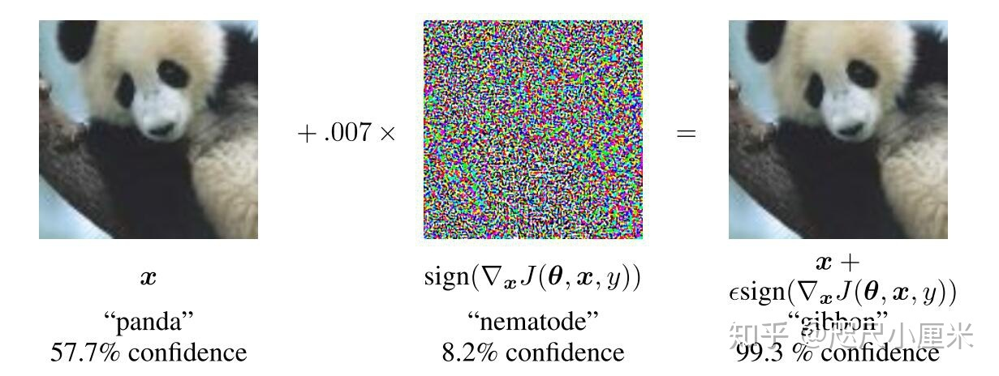

# Abtract
| <h5>传统观点 | 论文认为|
|----|---|
|对抗样本由极端非线性变换产生|高维中的线性变换就能引起对抗样本|
正则化不会显著降低模型对对抗样本的抵抗能力，但将模型改为非线性模型则可以提高模型对对抗样本的抵抗能力。
# Related Work
Szegedy等人展现了一些信息
<ol>
<li> Box-constrained L-BFGS可以可靠地找到对抗样本</li>
<li> 在某些数据集（例如ImageNet）上，对抗样本与原始样本是如此接近，以至于人眼无法区分这些差异；</li>
<li> 在许多情况下，在训练数据的不同子集上训练的、具有不同体系结构的各种模型都会将对抗样本错误分类</li>
<li> Shallow softmax回归模型也容易受到对抗样本的影响；</li>
<li> 对抗样本的训练可以使模型正规化，但是，由于需要在内部循环中进行昂贵的约束优化，因此这在当时不切实际</li>
</ol>

对于原来的模型，可以很好的处理自然发生的数据，但是当人们访问空间中数据分布可能性不高的点时，就会被发现是不真实的（误分类）。
# The linear explanation of adversarial examples
对于线性模型的对抗样本，对抗样本和权重向量的乘积为
$$
    w^T \tilde{x}=w^T x+w^T \eta
$$
$\eta$要大于特征的精度，但同时$\Vert \eta\Vert_{\infty}<\epsilon$,其中$\epsilon$可被相关传感器或数据存储设备丢弃

激活函数增长为$w^T\eta$.使$\eta=sign(w)$使其增长变为最大。如果$w$具有 n 个维度，并且权重向量的元素的平均大小为 $m$，则激活将以$\epsilon m n$增长。对于足够高维的模型(n足够大)则可以使激活变化足够大,则可以产生对抗样本。<B>此说明表明，如果简单线性模型的输入具有足够的维度，则可以具有对抗样本。先前针对对抗样本的解释调用了神经网络的假设属性，例如其所谓的高度非线性性质。我们基于线性的假设更简单，也可以解释为什么softmax回归容易受到对抗样本的影响。</B>
# Linear Perturbation of Non-linear Models
线性网络存在易于优化调整的特点，如 LSTM,ReLU和maxout网络。因此一些非线性网络为了易于优化也调整其在非饱和线性的状态，如Sigmoid网络。这种线性行为表明，线性模型的廉价的分析性扰动也会破坏神经网络。

设 $\theta$为模型参数， $\mathbf{x}$为模型输入，$\mathbf{x}$ 与 $y$相关联的目标（对于具有目标的机器学习任务），而$J(\theta,\mathbf{x},y)$为训练神经网络的损失函数。我们可以围绕 $\theta$的当前值来线性化损失函数，以获得 $\eta=\epsilon \ sign(\nabla_x J(\theta,\mathbf{x},y))$的optimal max-norm constrained pertubation（最优最大范数约束下的扰动）。我们将其称为生成对抗样本的“快速梯度符号方法”(fast gradient sign method,FGSM)。注意，可以使用反向传播有效地计算所需的梯度。

上图是在ImageNet上应用于GoogLeNet的快速对抗样本生成的演示。通过添加一个不明显的小向量，该向量的元素等于损失函数相对于输入的梯度元素的符号，我们可以更改GoogLeNet的图像分类。这里的.007的 $\theta$对应于GoogLeNet转换为实数后8位图像编码的最小位的大小。

这些简单、廉价的算法能够生成错误分类的示例，这一事实证明了我们对线性示例的对抗样本的解释。该算法还可以用作加速对抗训练的方法，甚至只是对受过训练的网络进行分析的一种方法。

# Adversarial Training of Linear Models Versus Weight Decay
[逻辑回归](./basic/Logistic_Regression/.md)

        