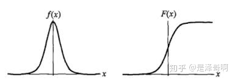

# 逻辑回归
# 1 介绍
Logistic Regression实际上是分类模型，常用于二分类。
Logistic 回归的本质是：假设数据服从这个分布，然后使用极大似然估计做参数的估计。
## 1.1 Logistic分布
Logistic 分布是一种连续型的概率分布，其分布函数和密度函数分别为：
$$
    \begin{align}
        F(x) &=P(X\leq x)=\frac{1}{1+e^{-(x-\mu)/\gamma}} \\
        f(x) &=F^{'}(X \leq x)=\frac{e^{-(x-\mu)/\gamma}}{\gamma(1+e^{-(x-\mu)/\gamma})^2}
    \end{align}
$$
其中， $\mu$表示位置参数， $\gamma>0$为形状参数。我们可以看下其图像特征：

## 1.2 Logistic 回归
用平面将超空间分开为两个部分，平面方程为
$$
w^T \mathbf{x}+b=0
$$
由于是两个部分，所以最理想的情况为
$$
    P(y=1|x)=\left\{
        \begin{align*}
            0,\ \ \ \ z&<0   \\
            0.5 \ \ \ z&=0,\ \ \ z=w^T \mathbf{x}+b\\
            1 \ \ \ \ z&>0 \\
        \end{align*}
     \right.
$$
但是不可导，于是用另一个值域为$[0,1]$,$P(y=1|x)+P(y=0|x)=1$的函数代替
$$
y=\frac{1}{1+e^{-(w^Tx+b)}}
$$
将y看做是后验分布概率则有
$$
    \begin{align*}
        w^Tx+b=ln\frac{P(Y=1|x)}{1-P(Y=1|x)}    \\
        P(Y=1|x)=\frac{1}{1+e^{-(w^Tx+b)}}
    \end{align*}
$$
其好处有
<ol>
<li>直接对分类的概率建模，无需实现假设数据分布，从而避免了假设分布不准确带来的问题（区别于生成式模型）</li>
<li>不仅可预测出类别，还能得到该预测的概率，这对一些利用概率辅助决策的任务很有用；</li>
<li>对数几率函数是任意阶可导的凸函数，有许多数值优化算法都可以求出最优解。</li>
</ol>

